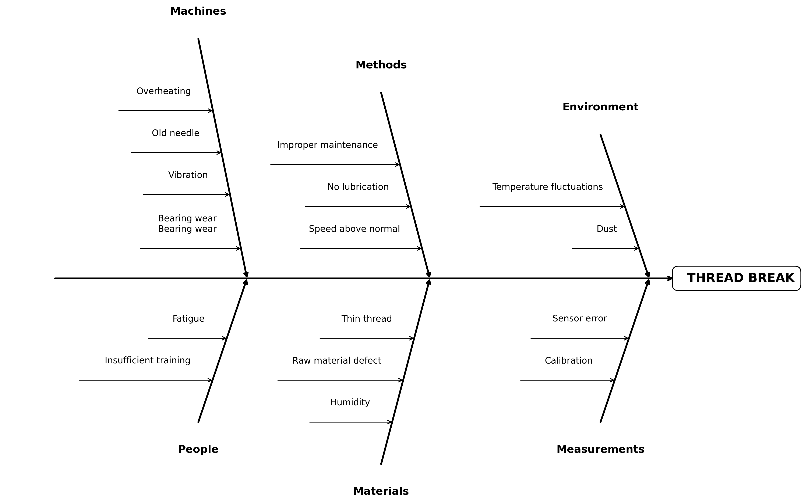

# Ishikawa Diagram

A library for creating dynamic Ishikawa diagrams (fishbone diagrams) in Python.

## Description

The Ishikawa diagram is a tool for analyzing cause-and-effect relationships, used in quality management and problem-solving. The diagram visualizes various causes of a problem by grouping them into categories.



## Installation

Requires installed uv

```bash
uv sync
```

## Usage

### Method 1: YAML File (Recommended)

Create a YAML file `diagram.yaml`:

```yaml
problem: "THREAD BREAK"

categories:
  Machines:
    - "Bearing wear\nBearing wear"
    - Vibration
    - Old needle
  
  People:
    - Fatigue
  
  Methods:
    - Speed above normal
    - No lubrication
  
  Materials:
    - Thin thread
    - Raw material defect
```

Load and save the diagram:

```bash
uv run main.py ./diagram.yaml ./diagram.png
```

Alternative YAML format with explicit structure:

```yaml
problem: "THREAD BREAK"

categories:
  - name: Machines
    causes:
      - Bearing wear
      - Vibration
  
  - name: People
    causes:
      - Fatigue
```

### Method 2: Python Code

```python
from main import draw_dynamic_ishikawa

# Define the problem
problem = "THREAD BREAK"

# Define categories and causes
data = {
    "Machines": [
        "Bearing wear",
        "Vibration",
        "Old needle"
    ],
    "People": [
        "Fatigue"
    ],
    "Methods": [
        "Speed above normal",
        "No lubrication"
    ],
    "Materials": [
        "Thin thread",
        "Raw material defect"
    ]
}

# Draw the diagram
draw_dynamic_ishikawa(problem, data)
```

## License

MIT

